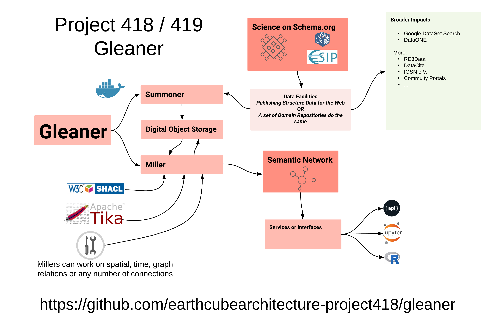

# Gleaner

## About


Gleaner is the structured data on the web indexing tool developed as part of 
 NSF EarthCube.  Its focus is on collection JSON-LD encoding data graphs describing 
 data resources and services.  Gleaner can then process and generate a semantic network based on a list of providers. 

*The Summoner*, which uses site map files to access and parse facility 
resources pages.  Summoner places the results of these calls into a S3 API 
compliant storage. 

*The Miller*, which takes the JSON-LD documents pulled and stored by 
summoner and runs them through various millers.  These millers can do 
various things. 




 The current millers are:

* text:  build a text index in raw bleve
* spatial: parse and build a spatial index using a geohash server
* graph: convert the JSON-LD to RDF for SPARQL queries

A set of other millers exist that are more experimental

* tika: access the actual data files referneced by the JSON-LD and process
    through Apache Tika.  The extracted text is then indexed in text system allowing 
    full text search on the document contents.
* blast: like text, but using the blast package built on bleve
* fdptika: like tika, but using Frictionless Data Packages
* ftpgraph: like graph, but pulling JSON-LD files from Frictionless Data Packages
* prov: build a basic prov graph from the overall gleaner process
* shacl: validate the facility resoruces against defined SHACL shape graphs 

## How to run (or at least try..., this is still a work in progress)

A key focus of current develoipment is to make it easy for groups to
run Gleaner locally as a means to test and validate their structured
data publishing workflow.  

### Running

The most recent documentation on running would be for the second 
release used during the 
[EarthCube Annual Meeting 2019](./docs/DEMO.md).

### Validation (SHACL Shapes)

Work on the validation of data graphs using W3C SHACL shape graphs is 
taing place in the [GeoShapes repository](https://github.com/geoschemas-org/geoshapes).  Gleaner leverages the pySHACL
Python package to perform the actual validation.  

### Profiling

You can profile runs with 

```bash
go tool pprof --pdf gleaner /tmp/profile317320184/cpu.pprof  > profileRun1.pdf
```

Example CPU and Memory profile of a recent release.  
