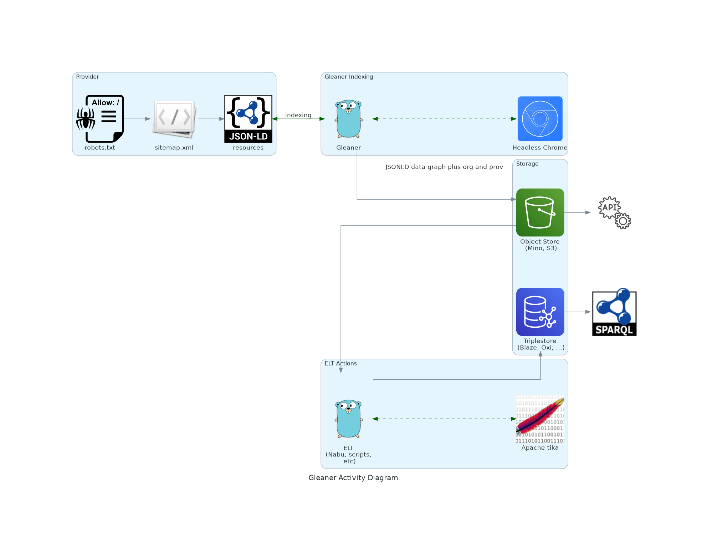

# Gleaner (https://gleaner.io)

## About

Gleaner is a tool for extracting JSON-LD from web pages. You provide Gleaner a list of sites to index and it will access and retrieve pages based on the sitemap.xml of the domain(s). Gleaner can then check for well formed and valid structure in documents and process the JSON-LD data graphs into a form usable to drive a search interface## About

 

The image above gives an overview of the basic workflow of Gleaner. There are four main sections to the image.

## Providers

## Gleaner Indexing

## ELT Actions

## Storage

## Interfaces

At present the best document for running gleaner can be found at the 
Ocean InfoHub pages for [Gleaner](https://book.oceaninfohub.org/indexing/qstart.html).
