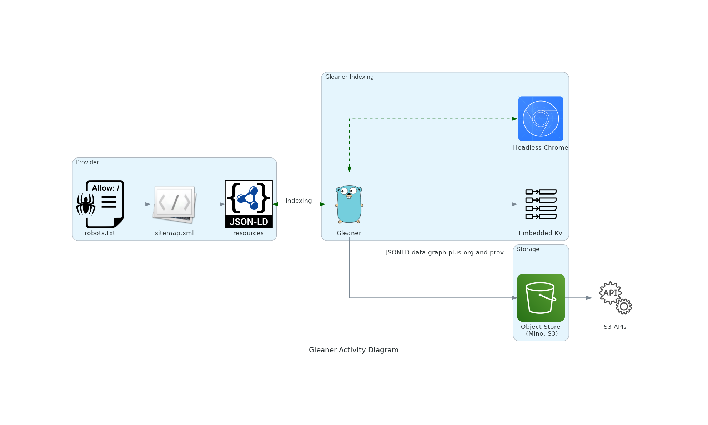
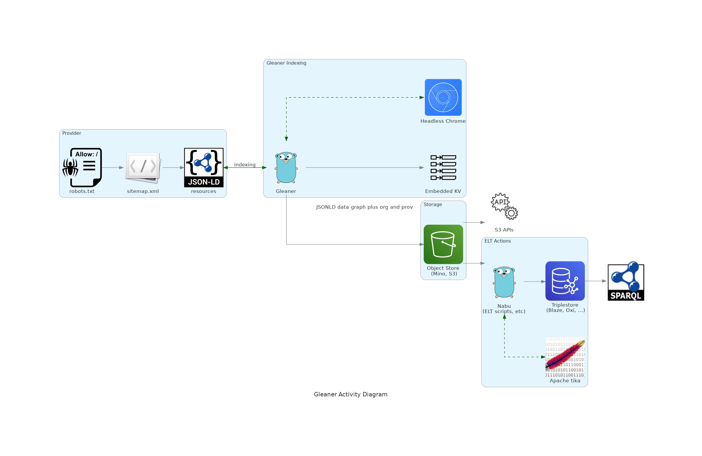

# Gleaner (https://gleaner.io)

## About

Gleaner is a tool for extracting JSON-LD from web pages. You provide Gleaner a 
list of sites to index and it will access and retrieve pages based on 
the sitemap.xml of the domain(s). Gleaner can then check for well formed 
and valid structure in documents.  The product of Gleaner runs can then
be used to form Knowledge Graphs, Full-Text Indexes, Semantic Indexes
Spatial Indexes or other products to drive discovery and use.  

## About

 

The image above gives an overview of the basic workflow of Gleaner. 

This image show that the product of Gleaner is really a populated
data warehouse (document warehouse).  Where those documents are 
either the JSON-LD structured data document harvested or the 
the provenance graphs generated by Gleaner during the process of
harvesting. 

Gleaner talks to an S3 compliant object store as part of its configuration.
This can be AWS S3, Google Cloud Storage (GCS) or other S3 compliant 
object stores.  A typical set up might see the use the open source
Minio package in this role.  

Note also the use of headless chrome in this diagram.  A headless chrome
instance is use for those cases where the resources to be harvested
are placing the JSON-LD documents into the document object model (DOM)
dynamically.   In this case then the headless chrome is used to render 
the page and run the Javascript to form the rendered HTML document that 
can be parsed for the JSON-LD.

 

This previous image gives a view of a typical completed installation
and use of Gleaner.   In this image we now see the use of the Nabu 
package (also in this Gleaner.io organization) to synchronize the 
data warehouse with a triple store. 

Nabu is described in its own repository but it basically reads the 
the JSON-LD document and performs ELT, ETL workflows on it.  In 
this case, a simple ETL of the JSON-LD.  Extracted from the S3, translated
from JSON-LD into ntriples and then loaded into the triplestores. 
If your triplestore natively handles the JSON-LD serialization of the RDF
then this could be a simple extract and load.   

## Code and Git Branch Patterns

### Go versions

Gleaner is written in [Go](https://golang.org/) and we ask 
that the developers stay in sycn with the latest stable 
release.  Go is a very stable language API so generally 
there are little issues with being off a version or two. 

Note that conflicts with the go.mod and go.sum are [not
unexpected](https://github.com/golang/go/issues/32485).  As noted
here, please resolve conflicts with these files by doing a
union followed by a 

```
go mod tidy
```

following the merge.   Once you have resolved the conflict and done 
tidy can add, if needed, the go.mod and go.sum files and commit.  

### Branches

If you are interested in working on Gleaner we ask that you use the following 
git pattern.  Branches should start with your initials followed by --
and then a name.   This can be a descriptive name or an issue name.  

Please branch off of dev and merge back into dev.   Given the small 
number of developers we hope this wont result in many conflicts.   As 
we agree on a version of dev that we like, we will make merges to master 
from which builds for releases and container will be done.  

```
$ git checkout -b [initials_or_team_name]--[your_branch_title_snake_case]
$ git checkout -b df--dev_doc_updates
< make some code changes >
$ git add .
$ git commit -m '[initials] <title of your changes>'

```

## Gleaner Indexing

While we work on bringing this repository documentation in line please 
visit:

* https://book.oceaninfohub.org/indexing/qstart.html
* https://book.oceaninfohub.org/indexing/cliDocker/README.html

For the best documentation on using Gleaner at this time.  

