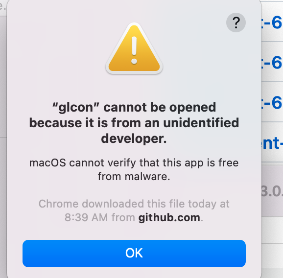
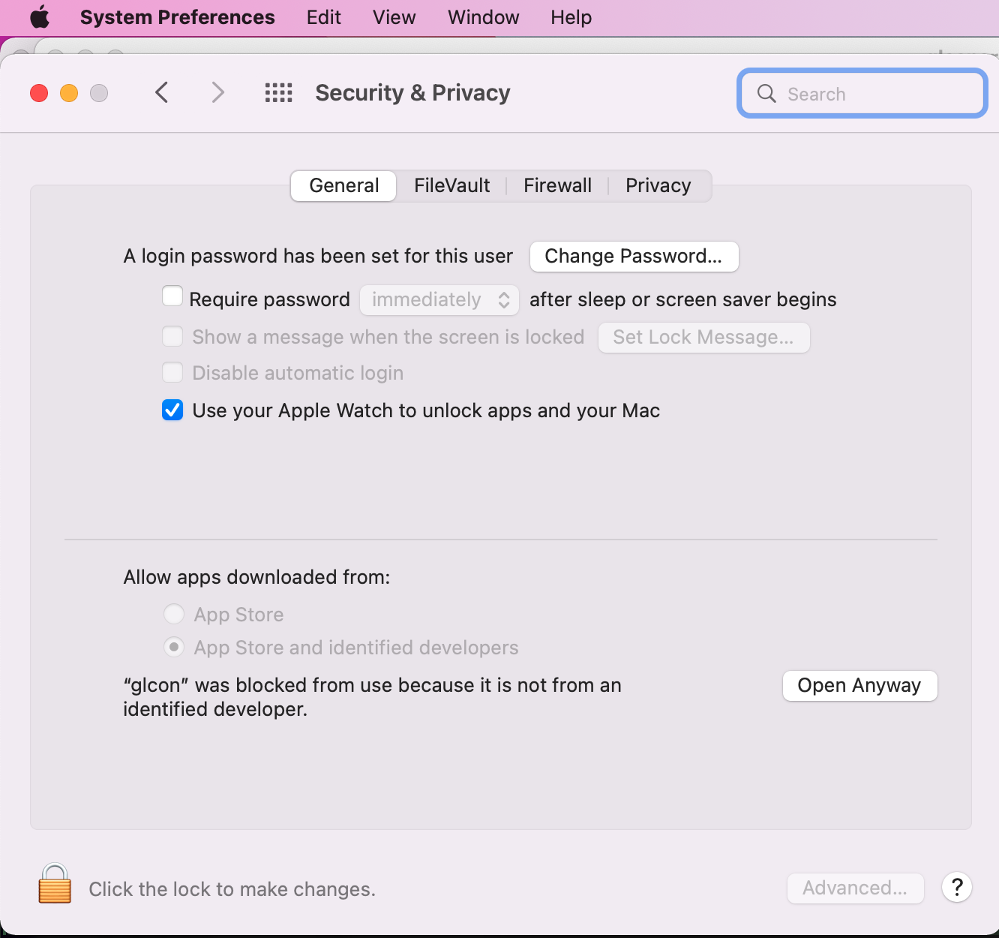
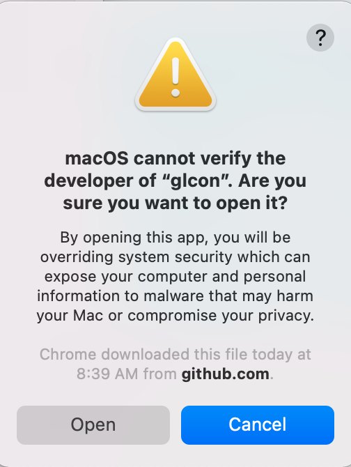
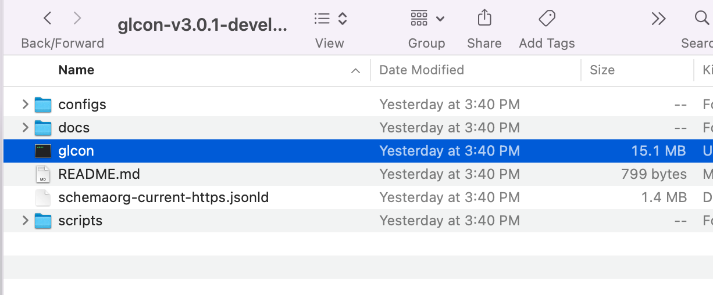

## Installing Release Binaries

Release binaries are automatically built when a release is created. Release builds do not always build, but they can be rerun with the hope that all will complete.

https://github.com/gleanerio/gleaner/releases

Two executables are built:
* gleaner
* glcon
* 
### Linux, Windows
download and uncompress

`./gleaner `

`./glcon --help`

### Mac
Using the executable build requires an extra step. 
download and uncompress.
* run, a dialog will appear, click ok
  
* open settings>security and privacy. at bottom of tab, it should ask that you approve the app
  
* another dialog confirms this change
  

Now you can run the executables

`./gleaner `

`./glcon --help`

(if someone wants to build a signed mac executable... https://www.kencochrane.com/2020/08/01/build-and-sign-golang-binaries-for-macos-with-github-actions/)

### Directory Layout
The directory includes a directory for configuration files, the latest json-ld schema from schema.or
and the executable. 

