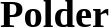

# Users of Gleaner

The following are some communities using or exploring the use of Gleaner.

##   EarthCube GeoCODES

[https://geocodes.earthcube.org/](https://geocodes.earthcube.org/)

GeoCODES is an NSF Earthcube program effort to better enable cross-domain discovery of and access to geoscience data and research tools. GeoCODES is made up of three components respectively.

##  Ocean InfoHub 
 
[https://oceaninfohub.org/](https://oceaninfohub.org/)

The Ocean InfoHub (OIH) Project aims to improve access to global oceans information, data and knowledge products for management and sustainable development.The OIH will link and anchor a network of regional and thematic nodes that will improve online access to and synthesis of existing global, regional and national data, information and knowledge resources, including existing clearinghouse mechanisms. The project will not be establishing a new database, but will be supporting discovery and interoperability of existing information systems.The OIH Project is a three-year project funded by the Government of Flanders, Kingdom of Belgium, and implemented by the IODE Project Office of the IOC/UNESCO.
 

## : Polar Data Discovery Enhancement Research

[https://polder.info/](https://polder.info/)

Federated metadata search for the polar regions will dramatically simplify data discovery for polar scientists. Instead of searching dozens of metadata catalogues separately, a user can come to a single search page.

This is a rapidly moving field and POLDER is working to find the best path forward for our community. POLDER is a collaboration between the Southern Ocean Observing System, Arctic Data Committee, and Standing Committee on Antarctic Data Management.
 
##   Canadian Consortium for Arctic Data Interoperability

[https://ccadi.ca/](https://ccadi.ca/)

The Canadian Consortium for Arctic Data Interoperability (CCADI) is an initiative to develop an integrated Canadian arctic data management system that will facilitate information discovery, establish sharing standards, enable interoperability among existing data infrastructures, and that will be co-designed with, and accessible to, a broad user base. Key to the CCADI vision are: standards and mechanisms for metadata, data and semantic interoperability; a distributed data exchange platform; streamlined data services with common entry, access, search, match, analysis, visualization and output tools; an intellectual property and sensitive data service; and data stewardship capacity.
 

##  Internet of Water 

[Geoconnex](https://internetofwater.org/geoconnex/)

Geoconnex rests on widespread adoption of metadata best practices, automatically harvesting metadata and indexing data to real-world hydrologic features (e.g. lakes, reservoirs, wells, streams, water distribution systems, monitoring locations). The resulting water-specific search index will be browsable from a common water metadata catalog for the IoW network in both a human and machine-readable format.
 

