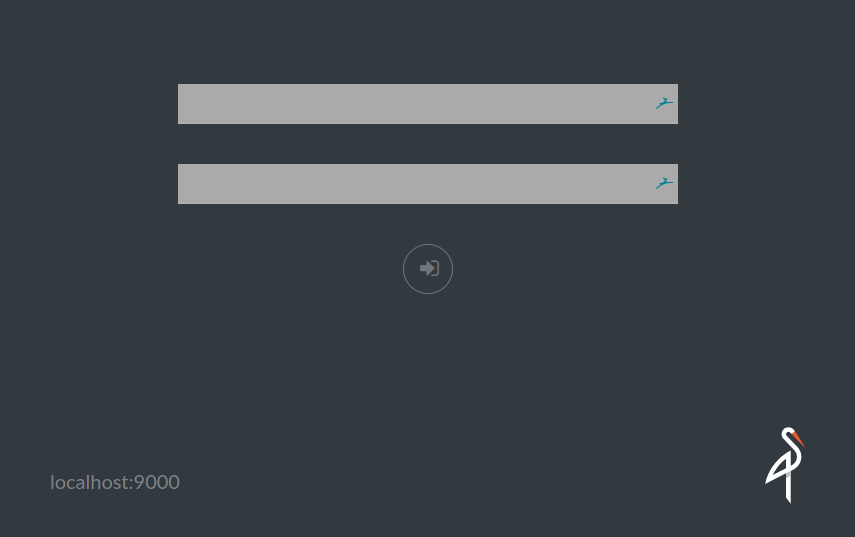
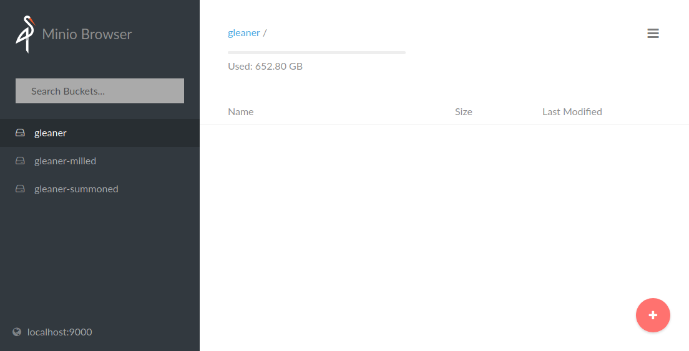
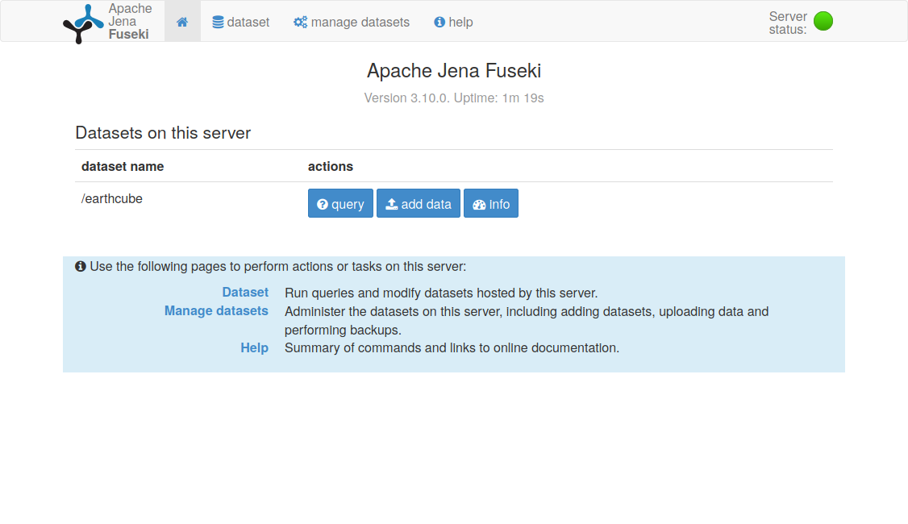
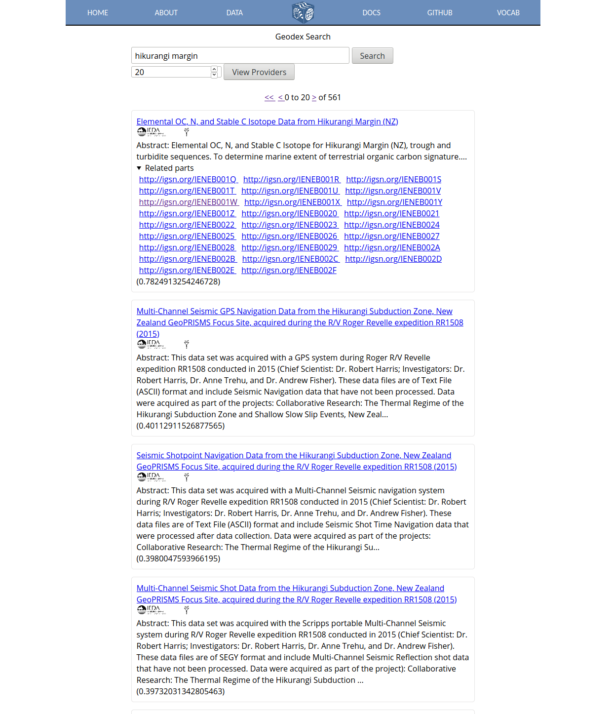

# Gleaner getting started

A video of this guide is available at: https://vimeo.com/372081748

This guide is intended to walk through getting started with Gleaner in the easier manner.   It is not the only way to use this program and may not be the best way for your environment or use case.  However, it will give a general overview and many of the points here are common across all the ways to use this program.

First, what is Gleaner.  Gleaner is a tool for extracting structured data on the web from a set of define providers.  It is not a web crawler and will not follow links in the pages it access.  It use a sitemap file created by a provider which is a set of URLs to resources Gleaner will visit.  Gleaner then extracts the structured data from the web represented by JSON-LD.  Some readers will note there are others ways, like RDFA, to represent this data on a web site.  Gleaner only looks for JSON-LD at this time.

If you are interested in publishing this sort of data, take a look at the ESIP hosted Science on Scheme GitHub repository and also the Google Developer Guide on publishing this sort of data as a provider.  

## **Prerequisites** 

### Docker 

To start this guide you will need a few things first.  One is a computer with Docker installed.  Docker is a popular tool for creating and using containers.  Containers are packaged applications like databases, games or web servers.  The Docker runtime providers a cross platform environment to run this common container images.  Images are downloaded from the net and can be maintained and updated.  Containers can be run in large cloud based environments with sophisticated orchestration systems or on your local computer.  For this example we will be running on a rather simple Linux based server provided by NSF's XSEDE environment.  However, any personal computer will do just fine.   You can download Docker your PC or Mac at https://www.docker.com/products/docker-desktop and Linux users can typically just use your distro's package management system.

Once you have Docker installed and verified its operation you will need to download the Gleaner "Stater Pack".  Reference the Gleaner releases at https://github.com/earthcubearchitecture-project418/gleaner/releases to download the needed files for this guide.   In particular the starterpack.zip located in the assets section of the releases.   

Gleaner is a command line application, so you will need a terminal program on your computer and be comfortable issuing basic commands.  

Testing on Windows has not taken place yet.  This documentation will be updated when that is done. These scripts are just simple Docker commands, so use them as a guide and we will work to generate the Windows scripts ASAP.

Note, when you first install Docker on a new system you will need to opt it into "swarm" mode to use the configuration files we will get to.  To do this use

```bash
docker swarm init
```

You can always turn swarm mode off late if you wish to.  Use:

```bash
docker swarm leave
```


### Starter Pack 

To provide you a set of files and scripts to bootstrap the process we have created a starter pack ZIP file.  Let's make a directory and download the starter pack.  Visit the web site at  https://github.com/earthcubearchitecture-project418/gleaner/releases  and find the latest release.  In the assets drop down section you will find links to the various assets of that release.  We will need the starterpack.zip file.  

Here we will use wget to download the file, but you could use curl or just web browser to download this file.   Be sure to visit the release page at GitHub and not just use the command from below as this will likely be out of date with the current release versions.

```bash
root@gleaner:~# mkdir gleanerRuns
root@gleaner:~# cd gleanerRuns/
root@gleaner:~/gleanerRuns# wget https://github.com/earthcubearchitecture-project418/gleaner/releases/download/2.0.11/starterpack.zip
[...]
Saving to: ‘starterpack.zip’
[...]
2019-11-05 04:53:10 (41.8 MB/s) - ‘starterpack.zip’ saved [1752/1752]

root@gleaner:~/gleanerRuns# unzip starterpack.zip
Archive:  starterpack.zip
  inflating: starterpack/demo.env
  inflating: starterpack/gleaner-base.yml
   creating: starterpack/shapefiles/
  inflating: starterpack/v2config.yaml
root@gleaner:~/gleanerRuns# cd starterpack/
root@gleaner:~/gleanerRuns/starterpack# ls -lt
total 164
-rw-r--r-- 1 root root    356 Oct 29 10:25 README.md
-rw-r--r-- 1 root root   1651 Oct 23 22:49 config.yaml
-rw-r--r-- 1 root root   1042 Oct 23 22:45 docker-compose.yml
-rwxr-xr-x 1 root root    320 Oct 23 22:42 runGleaner.sh
-rw-r--r-- 1 root root    137 Oct 23 21:40 demo.env
drwxr-xr-x 2 root root   4096 Oct 20 03:00 shapegraphs
-rw-rw-r-- 1 root root 141567 Oct  8 11:52 jsonldcontext.json
```

These files are the ones we will now start with. 

## **Setting the Environment Variables**

There are a few things we need to do first to set out the environment in which Gleaner will run.   One is actually set a few "environment variables".   If you look at the demo.env file you will see:

```bash
root@gleaner:~/gleanerRuns/starterpack# cat demo.env
# Set environments
export MINIO_ACCESS_KEY="MySecretAccessKey"
export MINIO_SECRET_KEY="MySecretSecretKeyforMinio"
export DATAVOL="./DV"
```

A note on these values.  The Minio entries are for the Minio object storage system that Gleaner uses and that we will install and run here soon via Docker.  You might wish to change these though note if you are just running Minio locally and for Gleaner only on a system not Internet accessible these are OK to start with.  Good practice would be to change them of course.    

#### Data Volume 

The DATAVOL variable will be used to define where Minio and other elements of the run store data.  You don't have to use a DATAVOL mount but it is a good idea.  First, it will persist your data should you shutdown and restart your Docker containers later, which you likely will.  Second, it will give a performance nudge over writing to the Docker file system, which is an abstraction over your native file system.   If you are more familiar with Docker, feel free to change this. 

#### Setting

We need to ensure these are set in our terminal (shell).   For most of you should be able to simply source this file and set the values.  In the following we will check for a variable, not find it, source the file and then confirm we see it. 

```bash
root@gleaner:~/gleanerRuns/starterpack# echo $DATAVOL

root@gleaner:~/gleanerRuns/starterpack# source demo.env 
root@gleaner:~/gleanerRuns/starterpack# echo $DATAVOL
./DV
```

Note that the file assumes BASH or a BASH compliant shell.  If you are running ZSH or another shell, there are some other steps you will need to take to set these values.  

Those of you more familiar with Docker might note you could copy this file to a new name.  Specifically a .env file located in the same directory as your docker-compose.yml file.  This should also work.  Also, the compose file actually reference this demo.env file as an "env_file" entry.   However, I have seen cases where some of these approaches do not always work, so manually setting them and confirming them is a good move unless you are more familiar with Docker and Docker annoyances.  

## Docker Compose command

We are not ready to set up the containers we need running to support Gleaner.  In the starter pack there is a file called docker-compose.yml.  It's a bit large for this document but you can view the version on GitHub at:  https://github.com/earthcubearchitecture-project418/gleaner/blob/master/docs/starterpack/docker-compose.yml

This file contains the instructions Docker will use to download and run the various container images we need.  If you look at the file you will see 6 images.  Their labels and a short description follow;

* mc
* glenaer
* minio
* tangram
* headless
* jena

### Getting the images

The first thing we can do is download the images we will need.  You do not need to do this separately, issuing the run command in Docker will check for and download any required images.  For this document, however, let's do it as a special command.   Note, you only need to download an image once, it will then been stored local to your system as an image and will run from there.  Later you can check for new versions or updates too.   If we look at our images we might not see anything if this is a new system with Docker.  

```bash
root@gleaner:~/gleanerRuns/staterpack# docker images
REPOSITORY          TAG                 IMAGE ID            CREATED             SIZE
```

Let's download our images.  Still in our starterpack directory we can use the command:

```bash
root@gleaner:~/gleanerRuns/starterpack# docker-compose -f docker-compose.yml pull
[... Docker will report out the progress here, I have removed it for brevity]
root@gleaner:~/gleanerRuns/starterpack# docker images
REPOSITORY                TAG                 IMAGE ID            CREATED             SIZE
chromedp/headless-shell   latest              2c051a7d9f70        10 hours ago        220MB
nsfearthcube/gleaner      latest              c5fb0023d473        2 weeks ago         104MB
minio/minio               latest              8869bca0366f        3 weeks ago         51MB
minio/mc                  latest              f4f9de663a7f        3 weeks ago         22.7MB
fils/p418tangram          0.1.15              833aa7811eb1        3 weeks ago         991MB
fcore/p418jena            0.1.11              879cafba0181        4 months ago        2.67GB
```

Depending on your network, this might take a minute or two.   After the pull command we can rerun the "docker images" command to now see the images we will be using for our run.   We host these at https://hub.docker.com/ and there are over a 100,000 containers there from the Docker community.  

### Run docker-compose

At this point we are ready to set up the environment.  As noted, do this without doing the above pull command is fine.  Docker will see what images it needs to satisfy a compose file and fetch them.  

We have:

* set up our environment variables
* downloaded our images

Next we need to issue the command to run these images.  We can see what containers we have already with the docker ps command as in:

```bash
root@gleaner:~/gleanerRuns/starterpack# docker ps
CONTAINER ID        IMAGE               COMMAND             CREATED             STATUS              PORTS               NAMES
```

Here we have no running containers.   Let's run some.

```bash
root@gleaner:~/gleanerRuns/starterpack# docker-compose -f docker-compose.yml up -d
WARNING: The Docker Engine you're using is running in swarm mode.

Compose does not use swarm mode to deploy services to multiple nodes in a swarm. All containers will be scheduled on the current node.

To deploy your application across the swarm, use `docker stack deploy`.

Creating network "starterpack_default" with the default driver
Creating network "starterpack_web" with driver "overlay"
Creating starterpack_jena_1 ... 
Creating starterpack_gleaner_1 ... 
Creating starterpack_minio_1 ... 
Creating starterpack_tangram_1 ... 
Creating starterpack_headless_1 ... 
Creating starterpack_mc_1 ... 
Creating starterpack_gleaner_1
Creating starterpack_jena_1
Creating starterpack_minio_1
Creating starterpack_mc_1
Creating starterpack_headless_1
Creating starterpack_jena_1 ... done
root@gleaner:~/gleanerRuns/starterpack# docker ps -a
CONTAINER ID        IMAGE                            COMMAND                  CREATED             STATUS                            PORTS                     NAMES
789f5343f06a        fils/p418tangram:0.1.15          "/bin/sh -c 'exec gu…"   12 seconds ago      Up 6 seconds                      0.0.0.0:8080->8080/tcp    starterpack_tangram_1
dc22eb223210        chromedp/headless-shell:latest   "/headless-shell/hea…"   12 seconds ago      Up 5 seconds                      0.0.0.0:32772->9222/tcp   starterpack_headless_1
7026b893f9b1        fcore/p418jena:0.1.11            "/usr/local/bin/entr…"   12 seconds ago      Up 4 seconds (health: starting)   0.0.0.0:3030->3030/tcp    starterpack_jena_1
730263a80255        minio/mc:latest                  "mc"                     12 seconds ago      Exited (0) 9 seconds ago                                    starterpack_mc_1
8beac8e063c2        minio/minio:latest               "/usr/bin/docker-ent…"   12 seconds ago      Up 6 seconds                      0.0.0.0:9000->9000/tcp    starterpack_minio_1
408610b309b9        nsfearthcube/gleaner:latest      "/gleaner/gleaner"       12 seconds ago      Exited (2) 8 seconds ago                                    starterpack_gleaner_1
root@gleaner:~/gleanerRuns/starterpack# 

```

A few things to note in the above:

#### swarm

The WARNING about swarm you likely will NOT see as you likely are NOT running in Swarm mode.  That is fine.  If you are running in swarm mode (you likely don't need this document) but you might be using the command

```bash
docker stack deploy --compose-file docker-compose.yml gleaner
```

as some swarm instances will not have the docker-compose command.

#### ports

You can see that our containers are using some ports to communicate on.  If you are experienced with Docker and running other containers you may have an issue where ports are already in use.  You will need to resolve that.  Note, Gleaner goes looking for services on these ports and I don't currently offer the ability to change that. So you will need to resolve it.   The required ports are: 8080, 32772, 3030 and 9000.   In future releases I will try and note that these should be changed to less popular ports.  8080 in particular may be problematic if you are running other containers as it's a popular port for local http services. 

## Gleaner Configuration

So now we are ready to review the Gleaner configuration file named config.yml.  There is actually quite a bit in this file, but for this starting demo only a few things we need to worry about.  The default file will look like:

```yaml
---
minio:
  address: localhost
  port: 9000
  accesskey: MySecretAccessKey
  secretkey: MySecretSecretKeyforMinio
  ssl: false
gleaner:
  runid: demo  # this will be the bucket the output is placed in...
  summon: true # do we want to visit the web sites and pull down the files
  mill: true
  tmpdir: ""
context:
  cache: true
contextmaps:
- prefix: "https://schema.org/"
  file: "/gleaner/config/jsonldcontext.json"
- prefix: "http://schema.org/"
  file: "/gleaner/config/jsonldcontext.json"
- prefix: "https://schema.org"
  file: "/gleaner/config/jsonldcontext.json"
- prefix: "http://schema.org"
  file: "/gleaner/config/jsonldcontext.json"
summoner:
  mode: diff  # [time, hash, none] diff: look for difference or full: delete old objects and replace
millers:
  graph: true
  shacl: false
  prov: false
shapefiles:
- ref: https://raw.githubusercontent.com/geoschemas-org/geoshapes/master/shapegraphs/googleRequired.ttl
- ref: https://raw.githubusercontent.com/geoschemas-org/geoshapes/master/shapegraphs/googleRecommendedCoverageCheck.ttl
sources:
- name: opencore
  logo: http://geodex.org/images/logos/EarthCubeLogo.png
  url: http://opencoredata.org/sitemap.xml
  headless: false
```

A few things we need to look at.

First, in the "mino:" section make sure the accessKey and secretKey here match the ones you have and set via your demo.env file. 

Next, lets look at the "gleaner:" section.  We can set the runid to something.  This is the ID for a run and it allows you to later make different runs and keep the resulting graphs organized.  It can be set to any lower case string with no spaces. 

The miller and summon sections are true and we will leave them that way.  It means we want Gleaner to both fetch the resources and process (mill) them.  

Now look at the "miller:"  section when lets of pick what milling to do.   Currently it is set with only graph set to true.  Let's leave it that way for now.  This means Gleaner will only attempt to make graph and not also run validation or generate prov reports for the process.  

The final section we need to look at is the "sources:" section.   Here is where the fun is.  

```yaml
sources:
- name: opencore
  logo: http://geodex.org/images/logos/EarthCubeLogo.png
  url: http://opencoredata.org/sitemap.xml
  headless: false
```

These are the sources we wish to pull and process.  Each source has 4 entries though at this time we no longer use the "logo" value.  It was used in the past to provide a page showing all the sources and a logo for them.  However, that's really just out of scope for what we want to do.  You can leave it blank or set it to any value, it wont make a difference.  

The name is what you want to call this source.  It should be one word (no space) and be lower case. 

The url value needs to point to the URL for the site map XML file.  This will be created and served by the data provider. 

The headless value should be set to false unless you know this site uses JavaScript to place the JSON-LD into the page.  This is true of some sites and it is supported but not currently auto-detected.  So you will need to know this and set it.  For most place, this will be false. 

You can have as many sources as you wish.  For an example look the configure file for the CDF Semantic Network at: https://github.com/earthcubearchitecture-project418/CDFSemanticNetwork/blob/master/configs/cdf.yaml

For this demo we will use the site map for Open Core data.  However, I would prefer to get a better and smaller example source that could highlight various capabilities and edge cases for this package.  

A more detailed review of the configuration file will be made and linked here.  

## **Run Gleaner via Docker**

With our configuration file ready we have arrived at the time when we can run Gleaner.  
First we need to make sure that we have Minio set up with the correct buckets.   Use the 
runGleaner.sh script with the --setup flag.  

```bash
root@gleaner:~/gleanerRuns/starterpack# ./runGleaner.sh --setup
my-vol
main.go:37: EarthCube Gleaner
main.go:92: Setting up buckets
check.go:56: Gleaner Bucket gleaner not found, generating
check.go:56: Gleaner Bucket gleaner-summoned not found, generating
check.go:56: Gleaner Bucket gleaner-milled not found, generating
main.go:98: Buckets generated.  Object store should be ready for runs
my-vol
```

We only need to run this the first time.  It will look for the Minio buckets (storage containers) we need and set them up if not found.  It wont hurt anything to run this again, so if you think you have not run it, go ahead and issue the command.  Likely this should just be an init call in the main run of Gleaner and then could be removed as a step.  

With our system set up, containers running, configuration file finished and the buckets created we are ready to run Gleaner. 

Simply use the command: 

```bash
root@gleaner:~/gleanerRuns/starterpack# ./runGleaner.sh
my-vol
main.go:37: EarthCube Gleaner
main.go:103: Validating access to object store
main.go:110: Validating access to needed buckets
check.go:37: Verified Gleaner bucket: gleaner.
check.go:37: Verified Gleaner bucket: gleaner-summoned.
check.go:37: Verified Gleaner bucket: gleaner-milled.
summoner.go:16: Summoner start time: 2019-11-06 14:12:46.636899634 +0000 UTC m=+0.025597505
resources.go:35: Parsing sitemap: http://opencoredata.org/sitemap.xml
sitemaps.go:49: Content type of sitemap reference is text/xml; charset=utf-8
opencore                  55m14s [--------------------------------------------------------------------] 100%
summoner.go:29: Summoner end time: 2019-11-06 15:08:01.708350533 +0000 UTC m=+3315.097048410 
millers.go:28: Miller start time: 2019-11-06 15:08:01.708401893 +0000 UTC m=+3315.097099749 
millers.go:41: Adding bucket to milling list: opencore
graphkv.go:29: Queuing URLs for opencore 
graphkv.go:238: Created tempdir /opencore   /tmp/opencore812448063
graphkv.go:54: opencore
graphkv.go:121: Start pipe reader / writer sequence
graphkv.go:121: Start pipe reader / writer sequence
millers.go:71: Miller end time: 2019-11-06 15:32:25.559500706 +0000 UTC m=+4778.948198623 
millers.go:72: Miller run time: 24.397518 
my-vol

```

This may take some time to run especially if you have added more resources or if those sites or your network connection is slow.  

## **Reviewing the output**

Once Gleaner is done and if everything has gone OK the results will be written to Minio buckets.   This is done to better support automated work flows with the data, but it doesn't lend itself to the easiest use by humans.  To access the results you will need a S3 capable client or your web browser.  

### Browser

The easiest way by far would be to access the Minio server via your web browser.  If you are running the Gleaner setup local this should work fine.  However, if you are running remotely you may or may not have access to the port 9000 that Minio is running on.  

If you do, simply point your browser at http://localhost:9000 (assuming the same, local, machine here).  

The login screen will look like:



Use your keys to login and the interface will look like:



### mc

For interested in a command line option Minio offers a free cross platform client.  For the client, go to https://min.io/download and download the mc client (not server) for your platform.  Follow the instructions to download and ensure the binary is executable so it can be run. 

You can then configure your server to the client with a command template like;

```bash
mc config host add <ALIAS> <YOUR-S3-ENDPOINT> <YOUR-ACCESS-KEY> <YOUR-SECRET-KEY> <API-SIGNATURE>
```

For our set up, it might look like.

```bash
mc config host add local http://localhost:9000 MySecretAccessKey  MySecretSecretKeyforMinio
```

You can then view the buckets, content and even copy the files from Minio to your local file system to work with.

```bash
root@gleaner:~/gleanerRuns/starterpack# wget https://dl.min.io/client/mc/release/linux-amd64/mc

[ ...  download progress removed ...]

root@gleaner:~/gleanerRuns/starterpack# chmod +x mc
root@gleaner:~/gleanerRuns/starterpack# ./mc config host add local http://localhost:9000 MySecretAccessKey  MySecretSecretKeyforMinio
Added `local` successfully.
root@gleaner:~/gleanerRuns/starterpack# ./mc ls local
[2019-11-05 10:23:53 HST]      0B gleaner/
[2019-11-06 05:32:13 HST]      0B gleaner-milled/
[2019-11-06 04:12:51 HST]      0B gleaner-summoned/
root@gleaner:~/gleanerRuns/starterpack# ./mc ls local/gleaner-summoned
[2019-11-06 05:47:37 HST]      0B opencore/
root@gleaner:~/gleanerRuns/starterpack# ./mc ls local/gleaner-milled
[2019-11-06 05:47:44 HST]      0B demo/
root@gleaner:~/gleanerRuns/starterpack# ./mc ls local/gleaner-milled/demo
[2019-11-06 05:32:13 HST]      0B opencore_BadTriples.nq
[2019-11-06 05:32:24 HST]  566MiB opencore_GoodTriples.nq
root@gleaner:~/gleanerRuns/starterpack# ./mc cp local/gleaner-milled/demo/opencore_GoodTriples.nq .
...opencore_GoodTriples.nq:  565.46 MiB / 565.46 MiB ┃▓▓▓▓▓▓▓▓▓▓▓▓▓▓▓▓▓▓▓▓▓▓▓▓▓▓▓▓▓▓▓▓▓▓▓▓▓▓▓▓▓▓▓▓▓▓▓▓▓▓▓▓▓▓▓▓▓▓▓▓▓▓▓▓▓▓▓▓▓▓▓▓▓▓▓▓▓▓▓┃ 100.00% 285.81 MiB/s 1s
root@gleaner:~/gleanerRuns/starterpack# ls -lt opencore_GoodTriples.nq 
-rw-r--r-- 1 root root 592925612 Nov  6 05:48 opencore_GoodTriples.nq
root@gleaner:~/gleanerRuns/starterpack# 

```

So now we would have the output from Gleaner in our directory.  The "Good triples" and "Bad triples" names are part of Gleaner reporting.  Any triples that Gleaner finds that are not properly formed according to the RDF spec get reported and routed to this file so providers can review the issues.  In this case we had no bad triples so the file was empty.  

The "Good triples" file can then be used in any RDF or RDF compatible triple store to support query and analysis. 

### Other tools

If you already use other tools to interact with S3 compliant object stores you can use them with minio as well.  These would be things like s3tools (python) or CyberDuck (Mac and Windows).  Since it's an S3 API, there are even ways you can mount Minio to your file system and view the buckets and simple folders on your machine.  

## **Load to a triple store and query** 

As part of the process of loading Gleaner container an example triple store is loaded.  This is the Jena Fuseki triple store and we can load our graph into this and begin to make queries on it.   This is outside the scope of Gleaner now, but we will review it briefly here at the end to give an idea of how Gleaner products could be used.

If you visit http://localhost:3030 you should find Jena available.  



Click the "add data" button to arrive at the screen where you can upload your data.   Here you can put in a named graph entry.  In the example below we used the run ID we provided to Gleaner.  Now use the "select files" button to select your file. 

Then click "upload all" to try and load the file.  If everything is OK with the RDF graph, you should get a nice green bar and the RDF will be loaded.  


Now use the query tab to navigate to the query interface and try out a query.  In this example, we already new what a resource URI was and used that in our search to see what data was associated with it.  You can explore more about SPARQL, the graph query language, at https://www.w3.org/TR/sparql11-overview/. 


Using something like Jena and SPARQL you could build out APIs or interfaces like we did with the https://geodex.org site below.




## Conclusion

This concludes the Gleaner walk through.  The goal was to go from nothing to a semantic network.  Gleaner is still in development as are these documentations.  Any issues, suggestions or edits you have are more than welcome and you are encouraged to use the GitHub issue system to provide them.  
